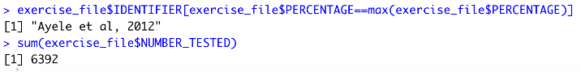

# Data scientist R exercise

The [Data_scientist_R](Data_scientist_R) folder contains the R script and the script outputs required by the data scientist programmer recruitment exercise (job reference: 1512). 

The folder includes:  
-  &emsp;[starting materials](Data_scientist_R/instruction_materials) provided by the recruitment team  
-  &emsp;[R script](Data_scientist_R/Data_Scientist_R_script.R) (R version 3.0.4) for processing the Excel file provided  
-  &emsp;[output file](Data_scientist_R/Data_Scientist_Exercise_Output_File.xlsx) in Excel format (.xlsx)
-  &emsp;[console printout screenshot](Data_scientist_R/console_print_out.png)  
-  &emsp;[knitted R markdown report](Data_scientist_R/Data_Scientist_R_script.docx) in Word format (.docx)


## R script
The [R script](Data_scientist_R/Data_Scientist_R_script.R) was written as requested to

> 1.	&emsp;read in the Excel file [Data_Scientist_Exercise_File.xlsx](Data_scientist_R/instruction_materials/Data_Scientist_Exercise_File.xlsx) into a dataframe
> 2.	&emsp;clean the text of the entries in the `DISEASE` column
> 3.	&emsp;filter the dataframe, so that only rows that have values in the `YEAR_PUBLICATION` column later than 2010 are kept
> 4.	&emsp;remove the columns `START_DATE_DATA` and `END_DATE_DATA` from the dataframe.
> 5.	&emsp;reorder the dataframe so that columns `STATE` and `DISEASE` are the last two columns of the dataframe.
> 6.	&emsp;split the `IDENTIFIER` column and create a new column called `AUTHOR` which does not contain the date, but just the text. Still keep the `IDENTIFIER` column.
> 7.	&emsp;output the dataframe to an Excel File called [Data_Scientist_Exercise_Output_File.xlsx](Data_scientist_R/Data_Scientist_Exercise_Output_File.xlsx)

&emsp;  
\***Note:** The [example output excel file](Data_scientist_R/instruction_materials/Data_Scientist_Exercise_Output_File.xlsx) given by the recruitment team is slightly different to the output here. The differences include:  
1. &emsp;The example output contained a mistake when filtering the `YEAR_PUBLICATION` column.
2. &emsp;The example output removed the `YEAR_PUBLICATION` column. If this column is not wanted, the following R code can be used: 
```
exercise_file <- subset(exercise_file, select = -YEAR_PUBLICATION)
``` 
3. &emsp;The example output file rounded the `PERCENTAGE` column to integer. If integer is wanted, the following R code can be used:
```
exercise_file$PERCENTAGE <- round(exercise_file$PERCENTAGE, digit=0)
```
&emsp;&emsp;If more significance figures are desired, simply change the `digit=0`.  

**( The above code can also be found in the [R script](Data_scientist_R/Data_Scientist_R_script.R) in the comments as extra. )**


## Summary numbers
For the following tasks: 

> Print out to the console the following summary numbers based on the cleaned dataframe:
> 1.	&emsp;The `IDENTIFIER` column value with the highest value in the `PERCENTAGE` column
> 2.	&emsp;The sum of the values in the column `NUMBER_TESTED`

A screenshot of the code and the console printout was taken:  




## R markdown report
The R script was knitted into an MS Word document (.docx). This [knitted R markdown report](Data_scientist_R/Data_Scientist_R_script.docx) was made so the R code and the outputs can be read easily, especially for those who only use Word. The report documented the processing code, the dataframe after all processes, and the summary numbers based on the cleaned dataframe. 

